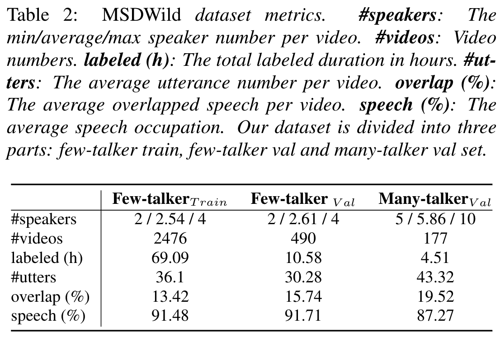
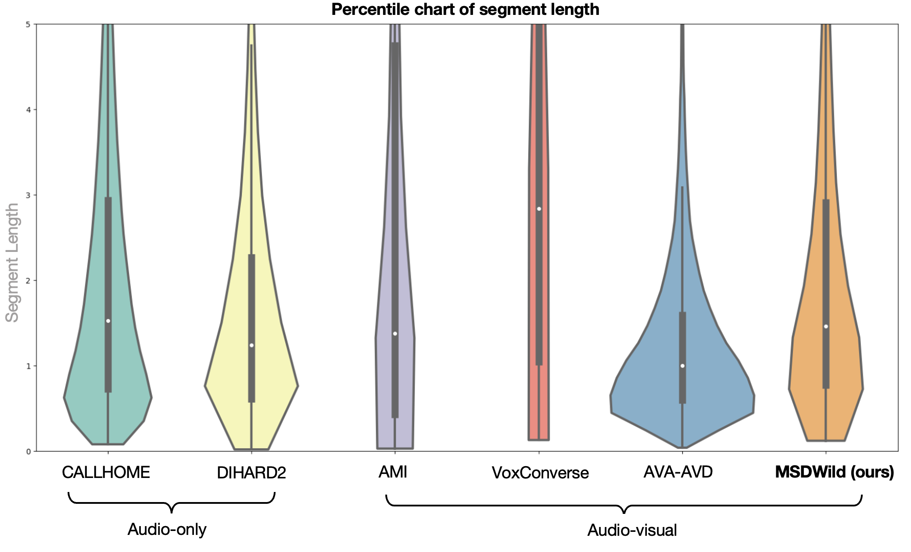
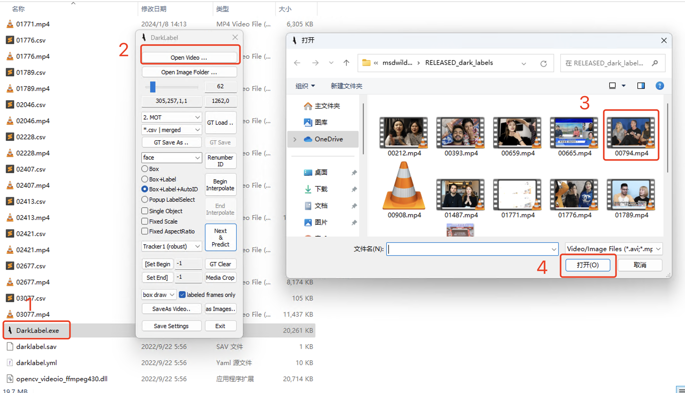
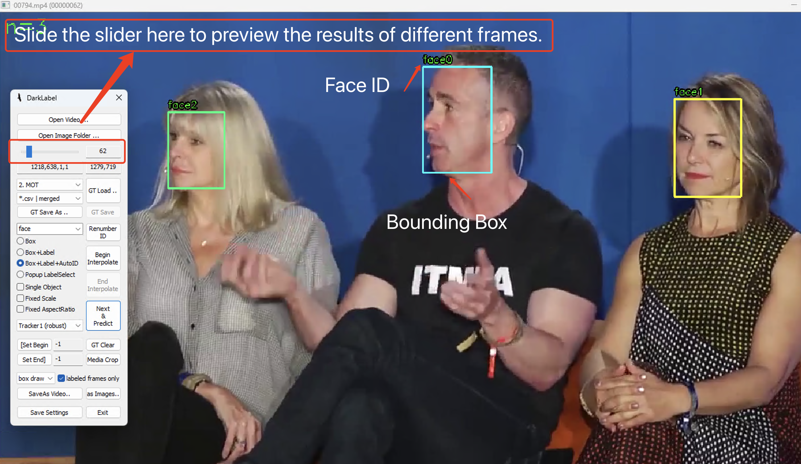
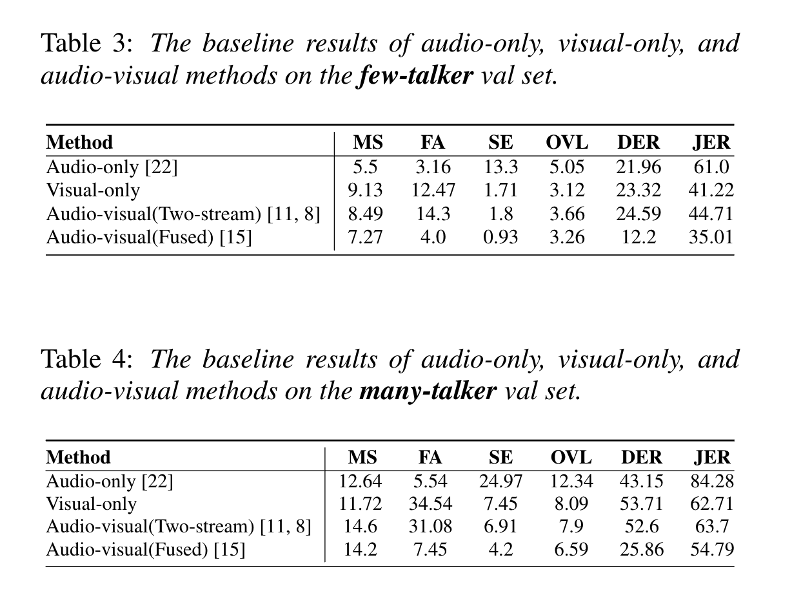
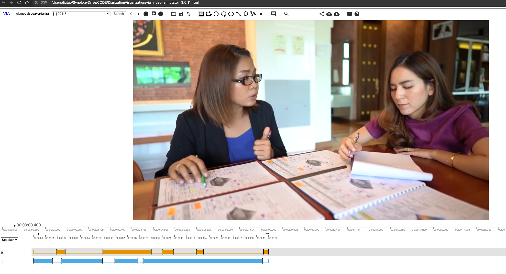

# MSDWild Dataset

> MSDWILD: MULTI-MODAL SPEAKER DIARIZATION DATASET IN THE WILD

This dataset is designed for multi-modal speaker diarization and lip-speech synchronization in the wild. [Demo](https://x-lance.github.io/MSDWILD)

* [2024/01/08 Updates] We have updated the IDs of the face bounding boxes as well as their positions in each frame.

## Dataset Statistics


## Dataset Comparison


Compared with other multi-modal datasets, the segment length distribution of our dataset is close to the audio-only in-the-wild diarization dataset, e.g., CALLHOME or DIHARD2.


## Labels
[rttms (all)](./rttms/all.rttm)

[rttms (few train)](./rttms/few.train.rttm)

[rttms (few val)](./rttms/few.val.rttm)

[rttms (many val)](./rttms/many.val.rttm)

## Wavs

-  [Google Drive (7.56 GB)](https://drive.google.com/file/d/1I5qfuPPGBM9keJKz0VN-OYEeRMJ7dgpl)

md5: 0057f82daaddf2ce993d1bf0679929c4

## Video part

- [Raw Videos (Google Drive, 43.14 GB)](https://drive.google.com/file/d/1fGYcJvqCEikZpwDq_84q4Pau5qO5Was1)

The video file name corresponds to the audio file name.

- [Cropped faces (Google Drive, 14.49 GB)](https://drive.google.com/file/d/1poGOdkXway5MkQEGWTtM9U7TegLSOw54)

(For Chinese researchers, you can use [Baidu Drive](https://pan.baidu.com/s/1hnrSKVDD9QS1bUnx4lV-Zg?pwd=t5t9) to speed up downloads. )


Our multimodal speaker diarization baseline includes a subtask - active speaker detection. To train the active speaker detection algorithm ([TalkNet](https://github.com/TaoRuijie/TalkNet-ASD)  mentioned in our paper), we utilize 'cropped faces.' These are randomly generated from videos based on video content and rttm labels, and subsequently, manually rectified. However, if you choose not to use these resources, you can ignore the 'cropped faces.'

There are four categories of cropped-face videos:

- NS_segmentid: The cropped face does not speak throughout the video.

- SPK_segmentid: The cropped face speaks throughout the video.

- TURN_segmentid_01_starttime_turntime_endtime: The cropped face does not speak from start_time to turn_time but starts speaking from turn_time to end_time.

- TURN_segmentid_10_starttime_turntime_endtime: The cropped face speaks from start_time to turn_time but does not speak from turn_time to end_time.

Time is denoted in seconds format, and Segment_id corresponds to the cropped face video id within each video folder.


**[Updates]** Please disregard files with negative filenames (approximately 90 files).


**Notes**:

* The database is **ONLY** for research purposes. 
* In response to community requests, we have uploaded a video.zip file due to some videos no longer being available online. This is to facilitate better replication of our work within the research community. These videos are solely for this purpose and must not be used otherwise. All usage must be in line with our [licensing agreement](MSDWILD_license_agreement.pdf). It's important to note that these materials may be removed at any time upon request from the original video owner.


## Videos with frame-by-frame face position annotation 

We have added additional **bounding boxes** for every facial image across the frames. Our trained annotators has reviewed the facial annotations on each frame to guarantee accuracy — no faces have been ignored or incorrectly tagged. Moreover, they have realigned any improperly positioned face bounding boxes. The refined annotations have been systematically archived in a correspondingly named directory, with the data structured in CSV files as outlined below. [One Sample](https://drive.google.com/file/d/106yqmxF0yfimexCsDxufeTIb3JeUKL-c)

```
CSV line: 3363,face,1,398,129,479,244,0

Description: frame id, face (fixed), face_id, x1, y1, x2, y2, 0 (fixed)
```

Download Link : [Google Drive (uploading, please wait 2-3 days)](#)

(For Chinese researchers, you can use [Baidu Drive](https://pan.baidu.com/s/1YpLMdCAcV0eG8fHmYf_lkw?pwd=msdb) to speed up downloads. )

 ### How to Preview Annotations
 


Clik `DarkLabel.exe` and select `one video file` to preview.



Move the `slider` to preview the positions and ID information of faces on different frames, not altering any other default settings.

**Notes**:

* The aforementioned video files have been standardized to a frame rate of 25 frames per second (fps), while the [original](https://drive.google.com/file/d/1fGYcJvqCEikZpwDq_84q4Pau5qO5Was1) frame rate may have varied.
* [DarkLabel](https://github.com/darkpgmr/DarkLabel) can be used for labelling or preview here. The `csv` file is generated by it. You can also use other tools by convert the `csv` file.
* `DarkLabel` only supports Windows (Win10 or Win11) currently and you may use wine (mentioned in this [issue](https://github.com/darkpgmr/DarkLabel/issues/4)) to run on Mac or Linux.
* The result can `not` directly converted to exactly the same [RTTM](./rttms/all.rttm) as some duration or face ids are adjusted and off-screen speech is not included in this part. By the way, the facial identification in each video is unique and also differs from the identifiers in [RTTM](./rttms/all.rttm) mentioned above.
* Different from the above-mentioned cropped face, the annotation here is for the bounding box of the unprocessed face in the original video.
* I suggest that this is merely supplementary material for this dataset. Possible future work we envision includes training an end-to-end multimodal speaker diarization that incorporates facial location information, and an evaluation method for a multimodal speaker diarization that takes into account the human face location.


## Baseline Code

You can easily reproduce the result by the following guide.

- **Audio-only** baseline are based on [Pyannote](https://github.com/pyannote/pyannote-audio). You can directly use [Hugging Face Edition](https://huggingface.co/pyannote/speaker-diarization). (Experiments are conducted on Pyannote ``094717b6`` and its hugging face ``3602c22f``)

- **Multi-modal** baseline are based on [TalkNet-ASD](https://github.com/TaoRuijie/TalkNet-ASD) (Pretrained models: ``msdwild.pretrained.model`` on our dataset can be downloaded from [URL](https://drive.google.com/file/d/1CdK3gRcs2pMaWB2s3X1n_0LuX6ZfQAE0)) for audio-visual realtion and [ArcFace](https://github.com/deepinsight/insightface/tree/master/recognition) for face clustering. 
    - Please add face recognition to the pipeline of [demoTalkNet.py](https://github.com/TaoRuijie/TalkNet-ASD/blob/main/demoTalkNet.py).
    - Search a best threshold from ``-0.5`` to ``0.5``.
    - If the prediction threshold is large than the best threshold, mark the corresponding frame as the active state (The minimal continuous frame is ``3``).
    - Convert the result to RTTM. 

No other post-processing methods are used.


## Baseline Result



## Analysis Result

You can refer to [URL](https://github.com/liutaocode/DiarizationVisualization) to visualize the dataset or your algorithm result.



## Acknowledgments

Thanks for [You Zhang](https://github.com/yzyouzhang) for helping to point out some annotation issues and improve the quality of the dataset.

## Reference

```
@inproceedings{liu22t_interspeech,
  author={Tao Liu and Shuai Fan and Xu Xiang and Hongbo Song and Shaoxiong Lin and Jiaqi Sun and Tianyuan Han and Siyuan Chen and Binwei Yao and Sen Liu and Yifei Wu and Yanmin Qian and Kai Yu},
  title={{MSDWild: Multi-modal Speaker Diarization Dataset in the Wild}},
  year=2022,
  booktitle={Proc. Interspeech 2022},
  pages={1476--1480},
  doi={10.21437/Interspeech.2022-10466}
}
```
