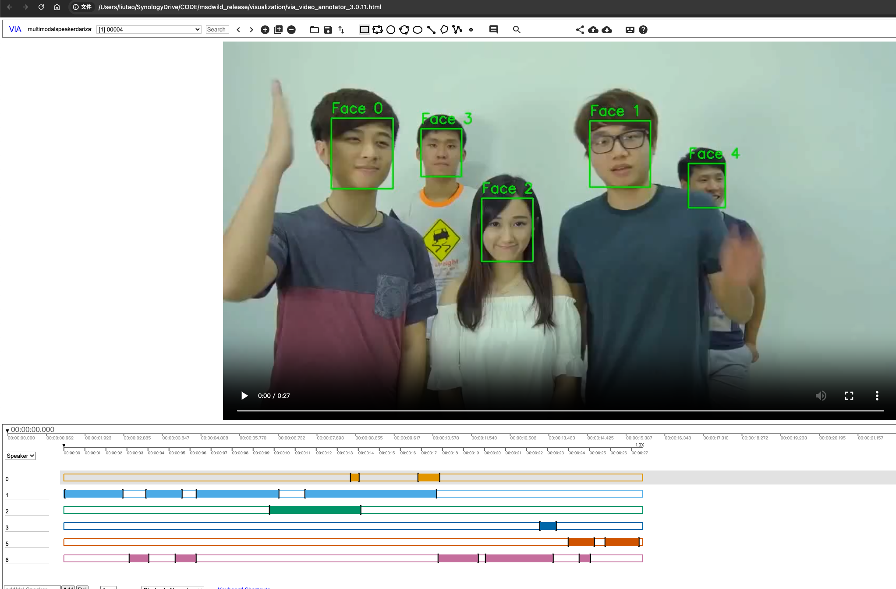

# Visualization
The purpose of this document is to explain how to visualize the location of faces and the corresponding audio files.

* rttm_per_file: RTTM files for each individual file
* original_mp4_files: Original video files, specifically from the RELEASED_dark_labels directory
* mp4_files_with_faces: Videos with visualized faces (including face ID and bounding boxes)
* csv_per_file: Darklabel tags
* json_per_file: Visualization JSON files

## Steps
To generate:
```
python convert_to_mp4_with_faces.py
```

## Preview
Open `via_video_annotator_3.0.11.html` and import an individual JSON file from the `json_per_file` directory.

## Sample Image



For further reference, see: [DiarizationVisualization](https://github.com/liutaocode/DiarizationVisualization)
